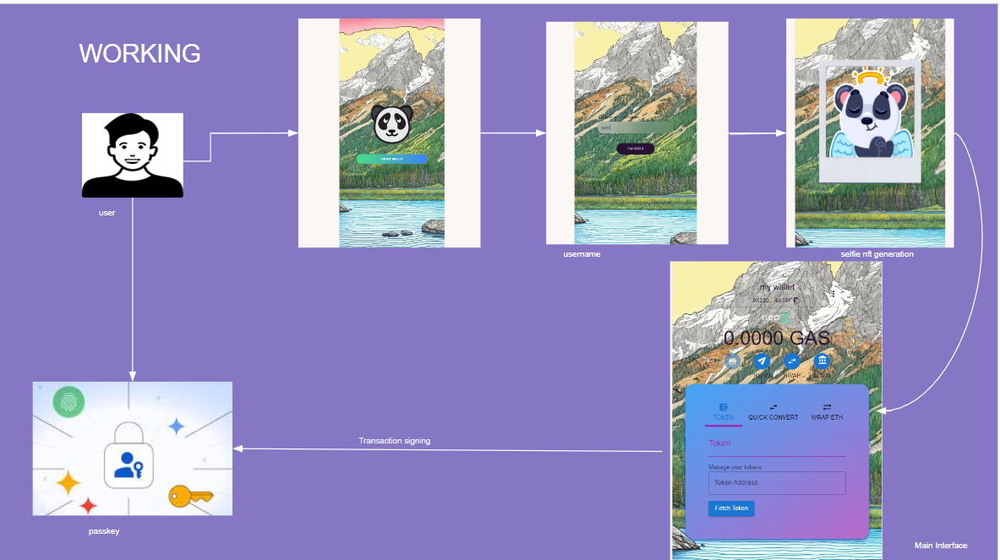
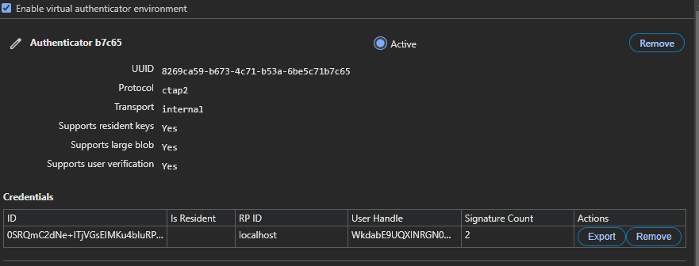
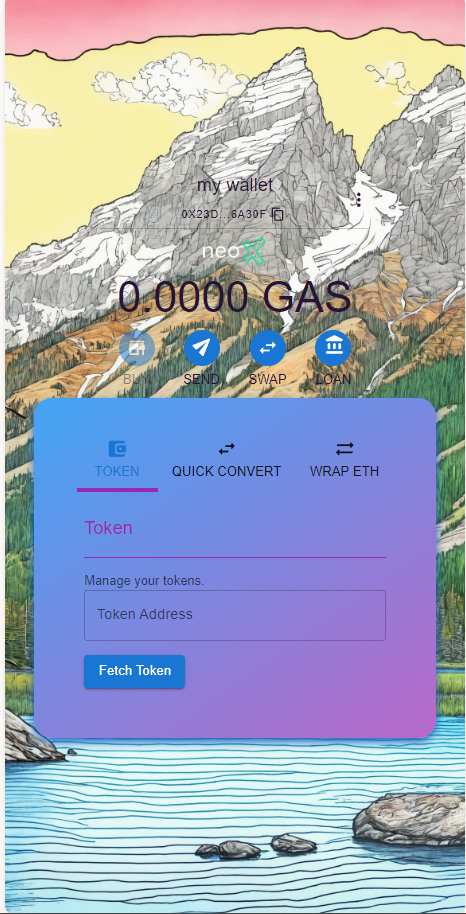

# PANDA WALLET

(click->click->click->your gateway to blockchain is ready)

The Panda wallet simplifies the user onboarding experience through a smooth one-click process. Leveraging the functionalities of account abstraction and passkeys, users can easily generate passkey credentials, set up a smart account, and deploy—all with just a single click on their smartphone or computer. The wallet operates discreetly, ensuring a seamless and hassle-free experience for users.

# Motivation

Blockchain is a transformative technology capable of addressing numerous societal challenges, with applications spanning across various sectors such as decentralized finance (DeFi), gaming, healthcare, and more. However, for an average user without extensive technical knowledge, navigating the blockchain landscape can be overwhelming, involving terms like wallet, private key, gas fees, secure private key, and others. Onboarding becomes a substantial hurdle for the ordinary user.

# Objective of Panda Wallet

Panda Wallet aims to address challenges through the integration of account abstraction and passkeys. This approach ensures a seamless onboarding experience for users with just a single click on their smartphone or laptop. Users can effortlessly generate passkey credentials and set up their smart accounts, streamlining the process for enhanced user convenience.

# Details

## UX OPTIMIZATION

Panda Wallet offers an optimal user experience with seamless one-click onboarding. This optimization is chosen to alleviate user concerns, as there is no need to worry about saving private key – all information is securely stored on the client's system.

## passkey implementation

Currently, the implementation of passkey-powered user operations involves the utilization of the secpR1 library from FCL. The system comprises an entrypoint contract and a custom paymaster contract designed to handle user fees. This configuration enables more individuals to easily access the realm of cryptocurrency.

## what about security?

Passkeys represent a contemporary evolution in Web2 security, poised to supplant traditional password management and its associated risks with robust ECC authentication, serving as an EoA. This transformative shift is facilitated through ERC-4337, promising to revolutionize accessibility and inclusivity in the realm of web3. Passkeys introduce a novel approach where the private key is securely stored in a hardened enclave, resilient against advanced attacks. This contrasts with keys stored in browsers, providing a heightened level of security. Additionally, passkeys mitigate phishing risks by linking them to a specific website, such as the dApp's site.

# Documentation

Panda Wallet aims to introduce blockchain technology to <strike>millions</strike> billions, of people worldwide. Users won't need to worry about any complexities— with just a single click, their wallet is ready for use. Accessible with a passkey, the Panda Wallet provides a user-friendly entry into the world of blockchain. All fees are sponsored, ensuring that users experience nothing but a classic, seamless web2 experience without any visible charges. <br><br>
 <br><br>
Step 1: **We are set to develop a smart contract wallet utilizing passkeys. Users will simply need to click on the 'Create Wallet' button to initiate the process.**


Step 2: **In this step, users are required to enter a username for the wallet. The passkey associated with this username will be securely stored in the system.**


Step 3: **At this step, a selfie is taken and uploaded to IPFS. An NFT is then minted as part of the wallet creation process.**


Step 4: **In this step, users are prompted to undergo biometric verification, with current options including Face ID and Touch ID, and support for additional methods like voice recognition in the future. The provided biometric credentials are used to derive the public key for ERC-4337. After verification, the credentials are securely stored in the local system. Users are prompted to grant permission for this process, which can be easily done using either a mobile device or laptop. The system ensures a seamless experience by automatically triggering the permission prompt, requiring no additional action from the user.**



Step 5: **After completing all the steps, a transaction containing essential information—such as the wallet's initcode, signature, and entry contract—is sent to the user operation mempool. Once this user operation is executed, your wallet will be fully ready for use.**



# Use cases

- Versatile Use Cases: Pandwallet offers a diverse range of applications within the blockchain space.

- Effortless User Onboarding: Any application can seamlessly utilize Pandwallet for user onboarding. With just a simple click, users can easily onboard into the decentralized application (dApp).

- Biometric Support: The passkey generation supports various biometric methods for enhanced security.

- Background Processing: Users experience a Web2-like interface where all processes occur seamlessly in the background.

- No Need for Separate Private Key Storage: Users are relieved from the task of storing private keys separately.

- Enhanced Security: Pandwallet provides a higher level of security compared to externally owned accounts (EOA).

# business plan

**Market details and descriptions have been incorporated.**

**1.1 Product/Service Offering**

- Panda Wallet simplifies user onboarding through a one-click process, provides secure passkey generation, and ensures a hassle-free smart account setup. This eliminates the complexities associated with traditional blockchain onboarding.

**1.2 Unique Selling Points**

- Seamless one-click onboarding.
- Enhanced security through passkey and account abstraction.
- Inclusive accessibility to blockchain for a global audience.

**2.1 Customer Acquisition**

- We will employ digital marketing channels, establish partnerships, and engage with the community to acquire users.

**2.2 Pricing Strategy**

- Our pricing strategy may include freemium models, subscription plans, or transaction-based pricing.

**2.3 Sales Channels**

- We plan to leverage online platforms and strategic partnerships for effective distribution.

# implementation details

**Off-chain Smartphone Signer:**

Upon initiating the "create account" process, our system employs a sophisticated off-chain smartphone signer. This signer generates a secure passkey by utilizing the biometric identification capabilities of the smartphone. Importantly, the FIDO passkey is securely stored within the smartphone's enclave, offering a formidable defense against potential phishing attempts. This is a notable improvement over conventional practices that store private keys in less secure memory zones, such as those within browsers. The resulting public key, derived from the passkey credential, is then transmitted to the main contract on the blockchain. Subsequent transactions within the system are authenticated using this passkey, enhancing security through biometric identification and decentralized passkey management.

**On-chain Transaction:**

Within the on-chain transaction process, the JavaScript front-end application facilitates the transmission of an authenticator challenge to the secure enclave of the smartphone. This method ensures a secure and reliable initiation and validation of transactions directly on the blockchain. The on-chain transaction mechanism introduces an additional layer of security and transparency to the overall system, bolstering the reliability of transaction processing.

# installation setup

The current implementation implementation seamlessly integrates with the Infinitism ERC4337 Entrypoint and a customized PayMaster. This integration facilitates the effortless payment of user fees, ensuring accessibility for users of all expertise levels.

#### Deploy contracts

```bash
forge script script/DeployAllAnvil.s.sol --private-key <PRIVATE_KEY> --broadcast -vvv --rpc-url <RPC_URL>
```

To execute the PayMaster, Bundler, and Frontend components, Docker containers would be utilized. This approach ensures a consistent and reproducible environment for running these elements, streamlining deployment and management across various systems.

webAuthAccount contracts control the passkey authentication.

#### Backend and frontend deployment

For backend and frontend deployment, navigate to the `Applications` directory and run the Docker command below.

```bash
docker-compse up -d
```

For setting up the `.env` file, please refer to the Applications folder. Running the above command will deploy four containers.

## Live contracts addresses

 <br>
entrypoint [0x0DCd1Bf9A1b36cE34237eEaFef220932846BCD82](https://xt4scan.ngd.network/address/0x0DCd1Bf9A1b36cE34237eEaFef220932846BCD82) <br>
webAuthn 0x9A676e781A523b5d0C0e43731313A708CB607508 <br>
webAuthnAccountFactory 0x0B306BF915C4d645ff596e518fAf3F9669b97016 <br>
paymaster 0x959922bE3CAee4b8Cd9a407cc3ac1C251C2007B1 <br>
<br>
